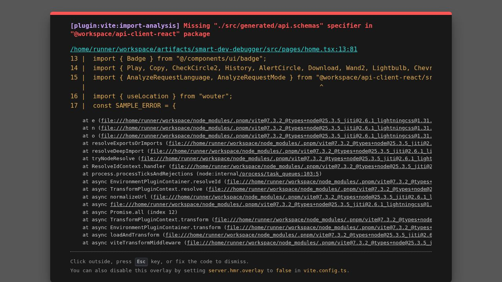

# Smart Dev Debugger

AI-powered debugging workspace for developers who want faster answers than raw stack traces can provide. Paste broken code and the error message, and the app returns a structured report with the root cause, a fix plan, a plain-English explanation, corrected code, and a senior-engineer pro tip.


## Preview / Demo



Core flow:

1. Sign up or log in
2. Paste code plus the error or stack trace
3. Choose a language and explanation mode
4. Receive a full debug report with corrected code
5. Revisit past sessions from history

## Features

- AI-generated root cause analysis for broken code and runtime errors
- Two explanation modes: `standard` and beginner-friendly `eli5`
- Corrected code output with copy and download actions
- Session history with per-user persistence
- Usage credits system for analysis requests
- Google OAuth and email/password authentication
- Request validation, rate limiting, and cached responses
- Shared API schema and generated client packages inside a pnpm monorepo

## Installation

### Prerequisites

- Node.js 20+
- `pnpm`
- PostgreSQL database URL
- An OpenAI-compatible model endpoint or key configured through `.env`

### Setup

1. Clone the repository.

```bash
git clone <repo-url>
cd "Dev Debugger"
```

2. Install workspace dependencies.

```bash
pnpm install
```

3. Create your environment file.

```bash
cp .env.example .env
```

4. Fill in the required values in `.env`.

5. Start the API server.

```bash
pnpm --filter @workspace/api-server dev
```

6. In a second terminal, start the frontend.

```bash
pnpm --filter @workspace/smart-dev-debugger dev
```

## Usage

After both apps are running:

1. Open the frontend in your browser.
2. Register a new account or sign in.
3. Paste the broken code into the code panel.
4. Paste the error message or stack trace.
5. Select the programming language.
6. Choose `standard` or `eli5` explanation mode.
7. Click `Debug Now` to generate the report.

The app returns:

- Root cause
- Severity
- Step-by-step fix instructions
- Explanation
- Corrected code
- Pro tip

## Configuration

Copy `.env.example` to `.env` and set the following values:

| Variable | Required | Purpose |
| --- | --- | --- |
| `NODE_ENV` | Yes | Runtime mode |
| `PORT` | Yes | API server port |
| `DATABASE_URL` | Yes | PostgreSQL connection string |
| `AI_INTEGRATIONS_OPENAI_API_KEY` | Yes | API key for the OpenAI-compatible provider |
| `AI_INTEGRATIONS_OPENAI_BASE_URL` | Yes | Base URL for the provider |
| `GOOGLE_CLIENT_ID` | Optional | Enables Google sign-in |
| `GOOGLE_CLIENT_SECRET` | Optional | Enables Google sign-in |
| `SESSION_SECRET` | Yes | Session and JWT signing secret |

Notes:

- Google OAuth is only active when both Google credentials are present.
- The frontend proxies `/api` requests to `http://localhost:3001` during local development.
- New users currently start with `100` debugging credits.

## Tech Stack

- React 19
- Vite
- TypeScript
- Express 5
- Drizzle ORM
- PostgreSQL
- TanStack Query
- Tailwind CSS 4
- Zod
- pnpm workspaces

## Project Structure

```text
Dev Debugger/
├── artifacts/
│   ├── api-server/               # Express API
│   ├── smart-dev-debugger/       # Main React frontend
│   └── mockup-sandbox/           # UI sandbox
├── lib/
│   ├── api-client-react/         # Generated React API client
│   ├── api-spec/                 # OpenAPI spec
│   ├── api-zod/                  # Generated schemas/types
│   ├── db/                       # Drizzle schema and DB helpers
│   └── integrations-openai-ai-*  # AI integration packages
├── scripts/                      # Workspace scripts
├── docker-compose.yml
├── Dockerfile
└── README.md
```

## Docker

This repository includes Docker files for running the API service in a container:

```bash
docker compose up --build
```

Current `docker-compose.yml` is focused on the API service. The frontend still runs separately during local development unless you extend the compose setup.

## API Highlights

Key routes implemented in the API:

- `POST /api/auth/register`
- `POST /api/auth/login`
- `POST /api/auth/logout`
- `GET /api/auth/me`
- `GET /api/auth/google`
- `POST /api/v1/analyze`
- `GET /api/v1/history`
- `GET /api/v1/history/:sessionId`
- `DELETE /api/v1/history`
- `GET /api/v1/stats`
- `GET /api/healthz`

## Contributing

Pull requests are welcome. If you want to make a larger change, open an issue first so the direction can be discussed before implementation.

Basic workflow:

1. Fork the repository
2. Create a feature branch
3. Make your changes
4. Run type checks
5. Open a pull request

Helpful command:

```bash
pnpm run typecheck
```

## License

MIT License
